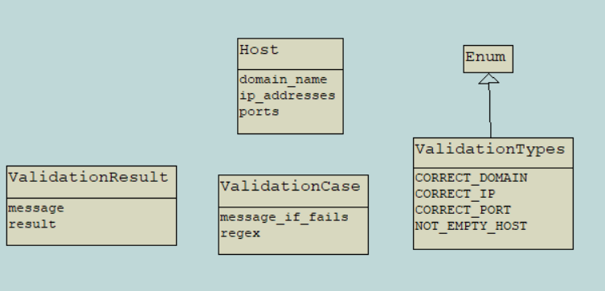
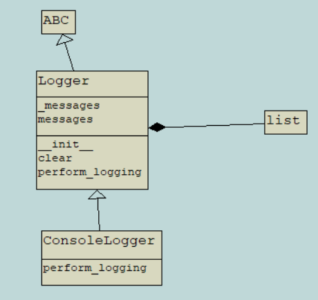
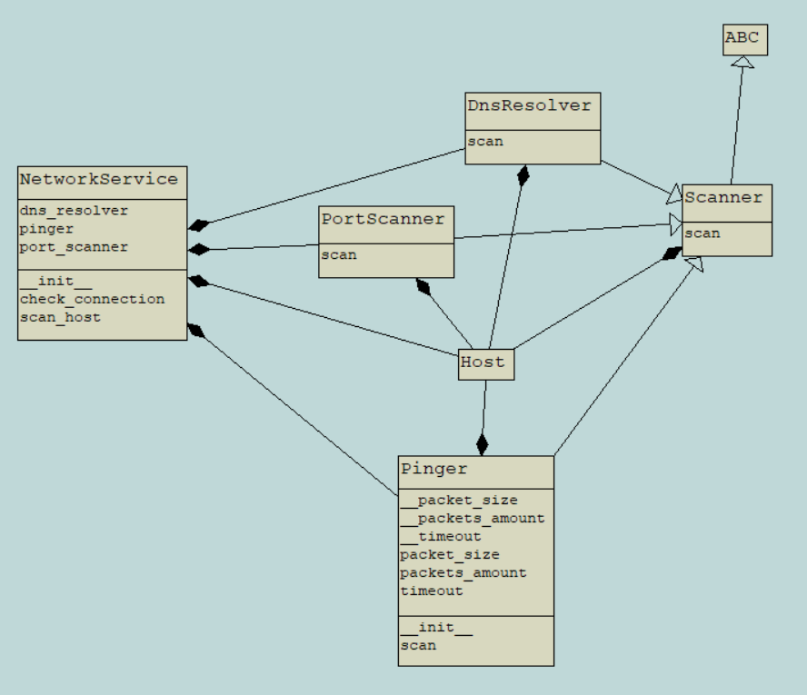
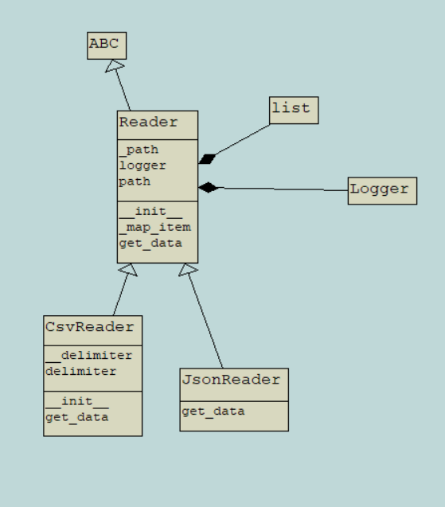

## Задание для полуфинала олимпиады "Траектория Будущего 22-23"
### Приложение для сетевой диагностики на Python

С помощью данного приложения можно мониторить активность ресурсов, полученных из различных файлов.
### Архитектура приложения
Приложение состоит из следующих модулей: 
1. Entities - содержит все сущности предметной области, представленные в data-классах и перечислениях.
2. Loggers - содержит иерархию классов для логирования.
3. Network - содержит классы для работы с сетью.
4. Readers - содержит классы для считывания данных с файлов.
5. Validation - содержит функции для валидации входных данных

#### UML диаграмма классов
\
\
\

### Как запустить?
В зависимости от ОС, на которой планируется запускать приложение, запустить в консоли run_script с указанием 
единственного параметра - пути до файла с входными данными.
Например: 

**Windows**: run_script.bat <путь до файла без кавычек>\
**Unix**: ./run_script.sh <путь до файла без кавычек>